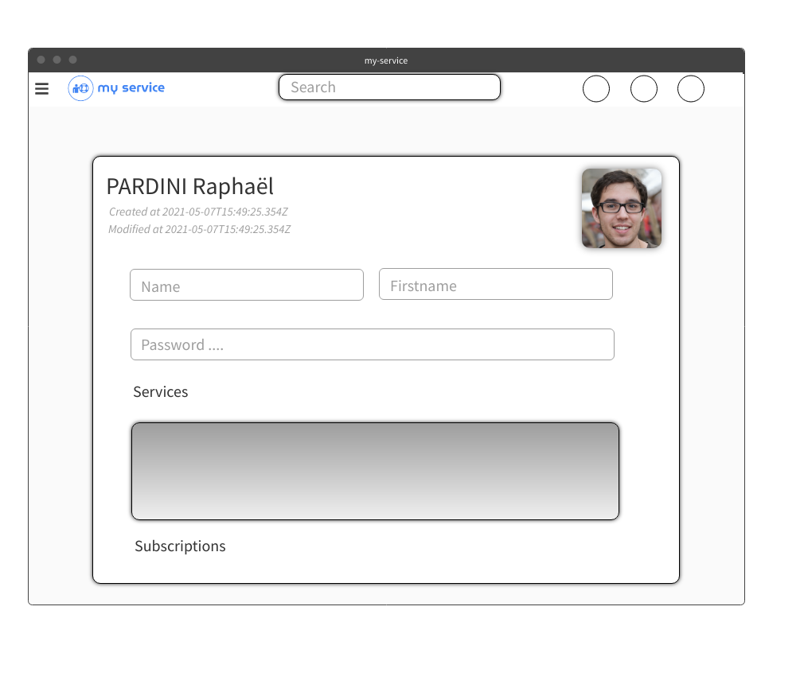

# Documentation fonctionnelle my-service

- [Documentation fonctionnelle my-service](#documentation-fonctionnelle-my-service)
  - [Introduction](#introduction)
  - [Les objectifs généraux du site et leur critère de succès](#les-objectifs-généraux-du-site-et-leur-critère-de-succès)
  - [Les utilisateurs cibles](#les-utilisateurs-cibles)
  - [Contraintes à respecter](#contraintes-à-respecter)
    - [Frontend](#frontend)
    - [Backend](#backend)
  - [Roles et responsabilités des acteurs](#roles-et-responsabilités-des-acteurs)
  - [Description de l’environnement technique](#description-de-lenvironnement-technique)
  - [Ergonomie du site](#ergonomie-du-site)
  - [Structure du site](#structure-du-site)
  - [Plan de tests effectué pour vous assurer du fonctionnement](#plan-de-tests-effectué-pour-vous-assurer-du-fonctionnement)
  - [Point de blocage](#point-de-blocage)
  - [Les évolutions à moyen et long terme](#les-évolutions-à-moyen-et-long-terme)

## Introduction

Au cours de cette année scolaire, nous avons remarqué que dans la classe nous avions chacun des matières dans lesquelles nous étions très bons et d'autres pour lesquelles nous avions plus de mal. Ces matières différant entre chaque personne, il était très intéressant de s’entraider et s’apportant des services mutuellement, chacun dans ses points forts. Et ce constat s’applique dans la plupart des domaines de la vie. Mais comment mettre en relation l’offre et la demande de service de manière optimale ? 
Nous avons alors eu l’idée de créer un site internet, que nous allons vous présenter ci-dessous.

## Les objectifs généraux du site et leur critère de succès

Ce site a pour but d’héberger des petites annonces de service, et de mettre en lien des utilisateurs.
Tout le monde peut créer un compte, proposer des services, ou souscrire aux différents services des autres utilisateurs.
Le but de ce site est de créer une entraide. 

Personne ne peut être expert dans tous les domaines.
Ainsi, vous pouvez être expert en comptabilité mais vous ne savez pas faire de site internet, et vous en avez besoin d’un. De l’autre côté, un développeur sait faire un site internet mais à besoin de réaliser de la comptabilité.
Alors, le comptable peut souscrire au service du développeur et le développeur pourrait également souscrire au service du comptable (un échange réciproque n’est pas obligatoire).

La souscription est réalisée à l’aide de PayPal.

Dans l’idée, faire un échange de service sans argent est assez tentant. Seulement, au vu de la complexité d’évaluer un service par rapport à un autre (e.g. un site internet ne vaut pas le même argent qu’un bilan comptable), nous avons envisagé cette fonctionnalité comme évolution à l’application.

## Les utilisateurs cibles

Toute personne peut s’inscrire sur le site internet. 
À partir du moment ou l’on souhaite soit proposer un/des services soit souscrire à un/des services, ce site est fait pour vous. 
Il a été conçu de manière à ce que l’interface et les fonctionnalités soient simples et intuitives, afin qu’il puisse être accessible à tous types de personnes et pour tous niveaux de compétences.
Pour cela nous avons respecté les critères de design très strict de Google (que nous expliquerons plus bas).

## Contraintes à respecter

L’une des contraintes primaires est la fragmentation de l’application.
En ce sens, le frontend doit être dissocié (cela ne veut pas dire indépendant) du backend et inversement.

Le code devra être écrit de manière à être un maximum réutilisable.
Pour le frontend, nous utilisons le système de components, de modules, des stores, etc…
Ainsi, le code peut très simplement être intégré à d’autres projets du fait de sa flexibilité.
Concernant le backend, nous avons découpé toute la logique (router, controller, model, middleware, etc…) afin d’obtenir un code clair et très maintenable.

### Frontend

1. Material Design
    Les règles de Google en design devront être respectées.

2. Paiement
    L’utilisateur peut souscrire à un service en payant à travers une API (PayPal ou Stripe).

### Backend

1. API REST
    L’application doit être un maximum conforme à la spécification [OpenAPI](https://www.openapis.org/)

    Pour ce faire, nous avons réalisé des routes selon la spécification et utiliser les verbes HTTP pour définir les actions du site (e.g. GET pour récupérer de l’information, PATCH pour modifier, DELETE pour supprimer, etc…)

    De plus, nous avons utilisé les statuts des requêtes HTTP afin d’expliquer un maximum les réponses des requêtes.

    La clé API doit être fournis dans l’header de la requête en tant que Authorization Bearer, comme défini au paragraphe [4.8.27.2.3](https://spec.openapis.org/oas/v3.1.0#jwt-bearer-sample)
    Le format JSON respecte la [RFC8259](https://datatracker.ietf.org/doc/html/rfc8259)

2. JWT
    L’authentification doit être sécurisée, compacte, courante et facile à utiliser.
    Ceci transparaît à travers l’utilisation de [JWT](https://jwt.io)

    JWT est également expliqué au paragraphe [4.8.27.2.3](https://spec.openapis.org/oas/v3.1.0#jwt-bearer-sample)

## Roles et responsabilités des acteurs

Étant donné notre cycle de développement agile, nous avons découpé les tâches de la manière suivante :

Au commencement de chaque itération, nous définissons l'ensemble des fonctionnalités qui sont attendues pour l’itération.
Puis, nous découpons ces fonctionnalités en plusieurs tâches et sous-tâches.
Enfin, nous avons répartis ces sous-tâches de manière équitable.

## Description de l’environnement technique

Le site a été réalisé en deux projets : un frontend et un backend.
Le frontend réalisé en VueJS appel en API un serveur backend en Express.

Toute la documentation technique du projet est disponible dans un document à part (voir documentation.html).
Nous avons préféré dissocier l’aspect technique de l’aspect fonctionnel.

## Ergonomie du site

Au niveau de l’ergonomie visuelle, nous avons utilisé les règles strictes de Google en termes de design.
Ceci nous emmène vers Material Design et Material Theming afin de rendre notre site le plus ergonomique et épuré possible.
Ces règles sont celles utilisées par Google en interne et pour tous leurs projets.
À cet égard, il est possible de choisir entre deux thèmes différents, qui s’appliquent sur toutes les pages du site : un thème jour et un thème nuit. Le thème nuit a, contrairement au thème jour, des couleurs plutôt sombres. Ceci a pour but premier de ne pas s’abimer les yeux lorsqu’on utilise notre écran dans le noir, mais il est aussi parfois préféré de manière esthetique par certaines personnes.
Nous avons également minimisé le nombre de pages différentes, afin que les utilisateurs ne soient pas perdus dans le plan du site.
Afin de faciliter leurs accès, toutes les pages sont accessibles depuis l’app bar et le drawer si l’utilisateur est connecté. Dans le cas où il n’est pas connecté, il a accès à la page d’accueil, de connexion et de création de compte.
Enfin, le site et les données personnelles des utilisateurs sont sécurisés. En ce sens, les mots de passe stockés dans la base de données sont chiffrés par une fonction de hachage, ce qui rend le mot de passe indéchiffrable même pour l'administrateur du site.

## Structure du site

/

Il s’agit de la page d'accueil du site internet.
Toute personne peut y avoir accès et peut effectuer des recherches dans le but de trouver un utilisateur ou un service.
Seulement, l’affichage d’un utilisateur est réservé aux utilisateurs connectés.
Ainsi, l’utilisateur sera redirigé vers la page de connexion.
Cette page de connexion contiendras l’url vers laquelle l’utilisateur sera redirigé après sa connexion (e.g.  /login?redirect=%2Fuser%2F60956185cc4a41f8be35fa2e)

/login

Cette page permet à un utilisateur de s’authentifier.
À l’issue de l’authentification, le client VueJS conserve un jeton JWT permettant d’identifier l’utilisateur au sein de l’application.

/signup

Cette page permet à un utilisateur de se créer un compte.
Afin d’être conforme RGPD, nous demandons un minimum d’informations.
L’utilisateur doit renseigner : 

* Nom
* Prénom
* Photo
* Mail
* Mot de passe

/timeline

_Nécessite que l’utilisateur soit connecté._
Cette page est la timeline d’un utilisateur connecté.
Sur cette page il peut :

* Découvrir des services d’autres utilisateurs
* Effectuer des recherches
* Filtrer les résultats selon des tags
* Ajouter un nouveau service
* Souscrire à un service

/me

_Nécessite que l’utilisateur soit connecté._
Cette page présente les informations du compte de l’utilisateur.
Sur cette dernière, il peut :

* Voir ses informations
* Modifier ses informations (nom, prénom, mail, etc…)
* Changer son mot de passe
* Voir l’ensemble de ses services
* Supprimer un service

/add

_Nécessite que l’utilisateur soit connecté._
Cette page permet à l’utilisateur de créer un nouveau service.
Elle se fait en deux étapes:

1. L’utilisateur doit rensigné 
  + Le nom du service (8 caractères minimum)
  + Une description du service (150 caractères minimum)
  + Des tags (1 minimum)
  + Un prix (strictement positif)

2. Le service est à présent créé. 
    L’utilisateur peut à présent ajouter une photo à son service. Il a la possibilité d’uploader une image ou d’ajouter l’image d’une URL.

/subscription

_Nécessite que l’utilisateur soit connecté._
Cette page présente l’ensemble des services pour lesquels l’utilisateur à souscrit.

/user/:id

_Nécessite que l’utilisateur soit connecté._
Cette page permet de voir le profil d’un utilisateur.
On regroupe ainsi l’ensemble (publique) des informations de l’utilisateur ainsi que l’ensemble de ses services.
L'utilisateur peut ainsi souscrire à un service depuis cette page.

/404

Toute requête qui ne dispose pas de route prédéfinie est redirigée sur cette page.

## Plan de tests effectué pour vous assurer du fonctionnement

Tout au long du développement, à chaque ajout de fonctionnalité, nous les testions afin de nous assurer qu’elles soient conformes à l’attendu.

Pendant le développement, il arrive que certaines fonctionnalités contiennent des bogues.
Lorsque cela arrive, nous arrêtons le développement de la fonctionnalité et corrigeons le problème.
Du fait de notre cycle de développement agile, l’application est restée fonctionnelle pendant toute la durée du projet.

Une fois le projet terminé, nous avons réalisé une recette fonctionnelle complète, en testant chacune des fonctionnalités de notre site, comme par exemple la création de compte, la mise en ligne d’un service, le paiement, le changement de thème…

## Point de blocage

Nous n’avons pas eu de blocage majeur, si ce n’est le temps.
L’aspect qui nous a pris le plus de temps est la documentation des différentes technologies que nous avons utilisées. Elles sont nombreuses (pour le frontend et le backend) et ont parfois des petites incompatibilités.

Nous n’avons pas de problème pour lesquels aucune solution n’a été trouvée.

## Les évolutions à moyen et long terme

A moyen terme, nous souhaitons ajouter la possibilité de noter les profils et/ou les services, ainsi que de pouvoir laisser un avis public. De plus, nous souhaitons mettre en place une messagerie instantanée entre les utilisateurs, afin qu’ils puissent discuter et avoir plus d'informations avant de souscrire à un service. 

A plus long terme, nous aimerions mettre en place un service de médiation, afin de régler les éventuels problèmes que peut rencontrer un utilisateur lors de la souscription à un service (description non conforme, service de mauvaise qualité …).
Enfin, nous souhaitons implémenter la possibilité de faire des échanges de services : aucune action monétaire ne sera effectuée, et la messagerie devrait aider à se mettre d’accord pour l’échange.
